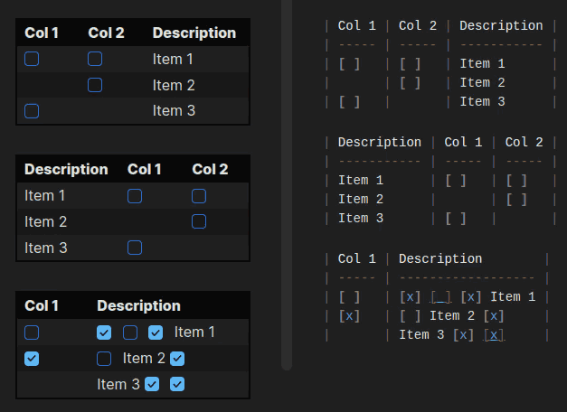

# Table Checkbox Renderer plugin for Obsidian

## Overview

Enables interactive checkboxes inside Markdown tables. When you click a checkbox in Reading Mode, the plugin updates the underlying Markdown source, keeping your table and file in sync. It supports multiple checkboxes per cell and works robustly for any table layout.

## Demo

## Features

- Interactive checkboxes in Markdown tables (Reading Mode).
- Supports multiple checkboxes per cell and per row.
- Changes are immediately saved to the Markdown file.
- Robust mapping between rendered checkboxes and source Markdown.
- Works with any table structure, including complex layouts.

## Usage

- Install the plugin in Obsidian.
- Create a Markdown table with checkboxes (e.g. `[ ]`, `[x]`).
- Click checkboxes in Reading Mode to toggle and save changes.
- In Edit Mode, checkboxes are in text form and can be toggled directly in the editor.

## How It Works

- The plugin parses the rendered table and the original Markdown source.
- For each table row, it matches checkboxes in each cell to the corresponding checkbox in the source line using a global index.
- When a checkbox is toggled, the plugin updates the correct `[ ]` or `[x]` in the Markdown file.
- In Edit Mode, a CodeMirror extension decorates checkboxes and allows toggling directly in the editor.

### Development

- Edit the TypeScript source files in the project directory.
- Install npm `npm install`.
- Run `npm run build` after making changes to produce the updated plugin files.
- Load the plugin in Obsidian's community plugins folder for testing.

## Contributing

Pull requests and suggestions are welcome!

## License

MIT
